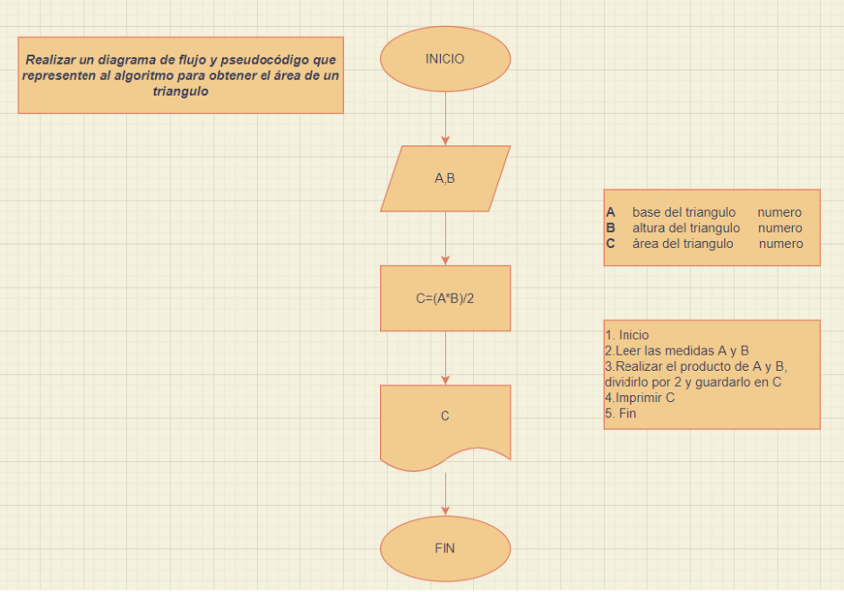

# DFD y Pseudocódigo

## Ejercicios

**1. Área de un triángulo**
- Realizar un diagrama de flujo y pseudocódigo que representen el algoritmo para obtener el área de un triángulo.
 

**2.Conversión USD**
- Una empresa importadora desea determinar cuántos dólares puede adquirir con determinada cantidad de pesos. Realizá un diagrama de flujo y pseudocódigo que representen el algoritmo para tal fin.

**3.Edad**
- Una empresa que contrata personal requiere determinar la edad de las personas que solicitan trabajo, pero cuando se les realiza la entrevista sólo se les pregunta el año en que nacieron. Realizá el diagrama de flujo y pseudocódigo que representen el algoritmo para solucionar este problema.

**4.Estacionamiento**
- Un estacionamiento requiere determinar el cobro que debe aplicar a las personas que lo utilizan. Considerá que el cobro es con base en las horas que lo disponen y que las fracciones de hora se toman como completas y realizá un diagrama de flujo y pseudocódigo que representen el algoritmo que permita determinar el cobro.

**5.Pinturería**
- Una empresa de pinturas requiere determinar cuánto cobrar por trabajos de pintura. Considerá que se cobra por m2 y realizá un diagrama de flujo y pseudocódigo que representen el algoritmo que le permita ir generando presupuestos para cada cliente.

**6.Hipotenusa**
- Se requiere determinar la hipotenusa de un triángulo rectángulo. ¿Cómo sería el diagrama de flujo y el pseudocódigo que representen el algoritmo para obtenerla? Recordá que por Pitágoras se tiene que: `La hipotenusa al cuadrado es igual a la suma de los otros dos lados al cuadrado (H2 = A2 + B2)`

**7.Precio final**
- Realizá un diagrama de flujo y pseudocódigo que representen el algoritmo para determinar cuánto pagará finalmente una persona por un artículo, considerando que tiene un descuento de 20%, y debe pagar 15% de IVA (debe mostrar el precio con descuento y el precio final).

**8.Ahorros**
- Realizá un diagrama de flujo y pseudocódigo que representen el algoritmo para determinar cuánto dinero ahorra una persona en un año si considera que cada semana ahorra 15% de su sueldo (considerá cuatro semanas por mes y que no cambia el sueldo).

**9.Cheque**
- Una empresa desea determinar el monto de un cheque que debe proporcionar a uno de sus empleados que tendrá que viajar durante un determinado número de días. Los gastos que cubre la empresa son: hotel, comida y 200 pesos diarios para otros gastos. El monto debe estar desglosado para cada concepto. Realizá un diagrama de flujo y pseudocódigo que representen el algoritmo que determine el monto del cheque.

**10.Área de un cuadrado**
- Realizá el diagrama de flujo y pseudocódigo que representen el algoritmo para encontrar el área de un cuadrado.

**11.Nota promedio**
- Realizá el diagrama de flujo y pseudocódigo que representen el algoritmo para determinar el promedio que obtendrá un alumno considerando que realiza tres exámenes, de los cuales el primero y el segundo tienen una ponderación de 25%, mientras que el tercero de 50%.

**12.Monto en cuotas**
- Dado un número real que representa el importe de una compra, informar las posibles formas de pago según la siguiente tabla. Espicificá los datos de entrada, de salida, estrategia.

```cmd
  1 cuota  de $................. 
  2 cuotas de $................. total $................. (   5% de recargo)
  6 cuotas de $................. total $................. ( 40% de recargo)
```